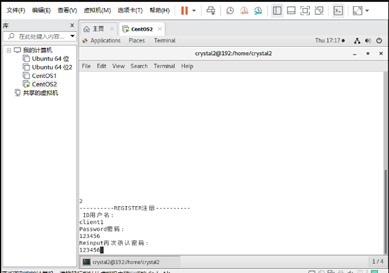
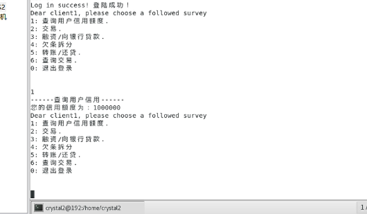
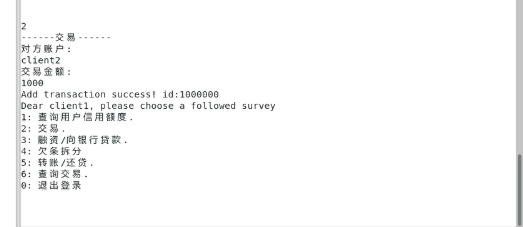
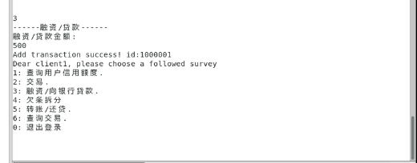
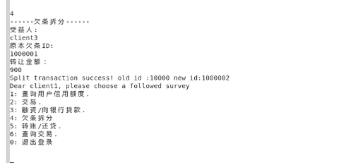
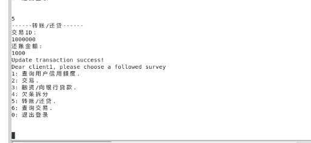
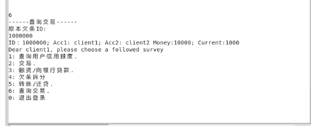

# 实验报告：
# 区块链大作业：基于区块链的供应链金融平台Report of BlockChain Final project
***Proudly produced by 18342079聂羽丞、18342081欧阳志强、18340021陈雪琪***


## 一、总体介绍
基于区块链、智能合约等，实现基于区块链的供应链金融平台。


## 二、项目内容
基于已有的开源区块链系统FISCO-BCOS（https://github.com/FISCO-BCOS/FISCO-BCOS），以联盟链为主，开发基于区块链或区块链智能合约的供应链金融平台，实现供应链应收账款资产的溯源、流转。


## 三、场景介绍

**传统供应链金融**

>某车企（宝马）因为其造车技术特别牛，消费者口碑好，所以其在同行业中占据绝对优势地位。因此，在金融机构（银行）对该车企的信用评级将很高，认为他有很大的风险承担的能力。在某次交易中，该车企从轮胎公司购买了一批轮胎，但由于资金暂时短缺向轮胎公司签订了1000万的应收账款单据，承诺1年后归还轮胎公司1000万。这个过程可以拉上金融机构例如银行来对这笔交易作见证，确认这笔交易的真实性。在接下里的几个月里，轮胎公司因为资金短缺需要融资，这个时候它可以凭借跟某车企签订的应收账款单据向金融结构借款，金融机构认可该车企（核心企业）的还款能力，因此愿意借款给轮胎公司。但是，这样的信任关系并不会往下游传递。在某个交易中，轮胎公司从轮毂公司购买了一批轮毂，但由于租金暂时短缺向轮胎公司签订了500万的应收账款单据，承诺1年后归还轮胎公司500万。当轮毂公司想利用这个应收账款单据向金融机构借款融资的时候，金融机构因为不认可轮胎公司的还款能力，需要对轮胎公司进行详细的信用分析以评估其还款能力同时验证应收账款单据的真实性，才能决定是否借款给轮毂公司。这个过程将增加很多经济成本，而这个问题主要是由于该车企的信用无法在整个供应链中传递以及交易信息不透明化所导致的。


**区块链+供应链金融：**

>将供应链上的每一笔交易和应收账款单据上链，同时引入第三方可信机构来确认这些信息的交易，例如银行，物流公司等，确保交易和单据的真实性。同时，支持应收账款的转让，融资，清算等，让核心企业的信用可以传递到供应链的下游企业，减小中小企业的融资难度。


**功能：**

> 功能一：实现采购商品—签发应收账款 交易上链。例如车企从轮胎公司购买一批轮胎并签订应收账款单据。
> 功能二：实现应收账款的转让上链，轮胎公司从轮毂公司购买一笔轮毂，便将于车企的应收账款单据部分转让给轮毂公司。轮毂公司可以利用这个新的单据去融资或者要求车企到期时归还钱款。
> 功能三：利用应收账款向银行融资上链，供应链上所有可以利用应收账款单据向银行申请融资。
> 功能四：应收账款支付结算上链，应收账款单据到期时核心企业向下游企业支付相应的欠款。


## 四、功能实现

>以下详细介绍如何一步一步实现上述功能，达到预期效果的
实现的设计思路为链端->后端->交互界面。但交互界面有由于小组内的成员都没有接触过网页的设计，所以最终采用了控制台的方式来实现。


首先，完成链端部分，为了实现最基本的功能，需要建立几个表格。第一个是资产管理表，以账户为主码，记录每一个账户的信用额度（可贷款预支的钱）；第二个是交易记录表，记录所有的新建交易、交易账单拆分、融资等交易的记录。建表内容在链端部分。
对应代码：

```
function createTable() private {  
        TableFactory tf = TableFactory(0x1001);  
        // 资产管理表, key : account, field : asset_value  
        // |   资产账户(主键)      |     信用额度       |  
        // |-------------------- |-------------------|  
        // |        account      |    asset_value    |  
        // |---------------------|-------------------|  
        //  
        // 创建表  
        tf.createTable("t_asset", "account", "asset_value");  
        // 交易记录表, key: id, field: acc1, acc2, money, status  
        // | 交易单号(key) | 债主 | 借债人 | 债务金额 |   状态   |  
        // |-------------|------|-------|---------|---------|  
        // |     id      | acc1 | acc2  |  money  | status  |  
        // |-------------|------|-------|---------|---------|  
        tf.createTable("t_transaction", "id","acc1, acc2, money, status");  
    }
```
这部分没有需要过多解释的地方，只是应用fisco自带的table.sol进行建表


**实现功能：账户注册**：
账户注册需要两个输入参数，账户名和信用资产值。打开表之后，向其中插入对应的内容。插入之前查询对应的账户名，如果没有对应的账户名选项，则插入成功。如果有，说明账户已经存在，不进行插入。插入成功则返回0，失败返回-2，已经有了对应账户返回-1.
具体实现如下：

```
function register(string account, int256 asset_value) public returns(int256){  
        int256 ret_code = 0;  
        int256 ret = 0;  
        int256 temp_asset_value = 0;  
        // 查询账户是否存在  
        (ret, temp_asset_value) = select(account);  
        if(ret != 0) {  
            Table table = openAssetTable();// 打开表  
            Entry entry = table.newEntry();  
            entry.set("account", account);  
            entry.set("asset_value", int256(asset_value));  
            // 插入  
            int count = table.insert(account, entry);  
            if (count == 1) {  
                // 成功  
                ret_code = 0;  
            } else {  
                // 失败? 无权限或者其他错误  
                ret_code = -2;  
            }  
        } else {  
            // 账户已存在  
            ret_code = -1;  
        } 
        emit RegisterEvent(ret_code, account, asset_value);  
        return ret_code;  
    } 
```


**实现功能：根据资产账户查询金额**：
实现过程主要是应用table.sol里面的select来打开表进行查询

```
function select(string account) public constant returns(int256, int256) {
        Table table = openAssetTable();// 打开表
        Entries entries = table.select(account, table.newCondition());
        int256 asset_value = 0;
        if (0 == uint256(entries.size())) {
            return (-1, asset_value);
        } else {
            Entry entry = entries.get(0);
            return (0, int256(entry.getInt("asset_value")));
        }
    }
```
函数返回值有两个，第一个确定账户是否存在，不存在返回-1，存在返回0；第二个返回有效金额，只有当地一个参数为0是第二个返回参数才有效。


**实现功能：交易查询**：

```
function select_transaction(string id) public constant returns(int256[], bytes32[]) {
        // 打开表
        Table table = openTransactionTable();
        // 查询
        Entries entries = table.select(id, table.newCondition());
        //         bytes32[] memory str_list = new bytes32[](2);

        int256[] memory int_list = new int256[](3);   //ret_code, money, status
        bytes32[] memory str_list = new bytes32[](2);   //acc1, acc2
        if (0 == uint256(entries.size())) {
            int_list[0] = -1;
            return (int_list, str_list);
        } 
        else {
            Entry entry = entries.get(0);
            int_list[1] = entry.getInt("money");
            int_list[2] = entry.getInt("status");
            str_list[0] = entry.getBytes32("acc1");
            str_list[1] = entry.getBytes32("acc2");
            return (int_list, str_list);
    }
```
同上，根据table.sol的方法用id查表即可


**实现功能：添加交易记录**：

```
function addTransaction(string id, string acc1, string acc2, int256 money) public returns(int256){
        int256 ret_code = 0;
        int256 ret = 0;
        bytes32[] memory str_list = new bytes32[](2);
        int256[] memory int_list = new int256[](3);
        // 查询交易是否存在
        (int_list, str_list) = select_transaction(id);
        if(int_list[0] != int256(0)) {
            Table table = openTransactionTable();
            Entry entry0 = table.newEntry();
            entry0.set("id", id);
            entry0.set("acc1", acc1);
            entry0.set("acc2", acc2);
            entry0.set("money", int256(money));
            entry0.set("status", int256(money));
            // 插入
            int count = table.insert(id, entry0);
            if (count == 1) {
                // 将欠款人的信用额度转移一部分给债主
                ret = transfer(acc2,acc1,money);
                // 信用额度转让失败
                if(ret != 0) {
                    ret_code = -3;
                } else {
                    ret_code = 0;
                }
            } else {
                // 失败? 无权限或者其他错误
                ret_code = -2;
            }
        } else {
            // 交易ID已存在
            ret_code = -1;
        }
        emit AddTransactionEvent(ret_code, id, acc1, acc2, money);
        return ret_code;
    }
```
返回0表示交易添加成功，-1 交易ID已存在，-2 其他错误，-3 信用额度转让失败，注意要先查询交易是否存在，再进行查询。


**实现功能：信用额度转移**：

```
function transfer(string from_account, string to_account, int256 amount) public returns(int256) {
        // 查询转移资产账户信息
        int ret_code = 0;
        int256 ret = 0;
        int256 from_asset_value = 0;
        int256 to_asset_value = 0;
        // 转移账户是否存在?
        (ret, from_asset_value) = select(from_account);
        if(ret != 0) {
            ret_code = -1;
            // 转移账户不存在
            emit TransferEvent(ret_code, from_account, to_account, amount);
            return ret_code;

        }
        // 接受账户是否存在?
        (ret, to_asset_value) = select(to_account);
        if(ret != 0) {
            ret_code = -2;
            // 接收资产的账户不存在
            emit TransferEvent(ret_code, from_account, to_account, amount);
            return ret_code;
        }
        if(from_asset_value < amount) {
            ret_code = -3;
            // 转移资产的账户金额不足
            emit TransferEvent(ret_code, from_account, to_account, amount);
            return ret_code;
        } 
        if (to_asset_value + amount < to_asset_value) {
            ret_code = -4;
            // 接收账户金额溢出
            emit TransferEvent(ret_code, from_account, to_account, amount);
            return ret_code;
        }
        Table table = openAssetTable();
        Entry entry0 = table.newEntry();
        entry0.set("account", from_account);
        entry0.set("asset_value", int256(from_asset_value - amount));
        // 更新转账账户
        int count = table.update(from_account, entry0, table.newCondition());
        if(count != 1) {
            ret_code = -5;
            // 失败? 无权限或者其他错误?
            emit TransferEvent(ret_code, from_account, to_account, amount);
            return ret_code;
        }

        Entry entry1 = table.newEntry();
        entry1.set("account", to_account);
        entry1.set("asset_value", int256(to_asset_value + amount));
        // 更新接收账户
        table.update(to_account, entry1, table.newCondition());

        emit TransferEvent(ret_code, from_account, to_account, amount);

        return ret_code;
    }
```
一切正常时返回0，资产转移成功，转移账户不存在时返回-1，接收资产账户不存在时返回-2， 金额不足时返回-3，金额溢出返回-4，其他错误返回-5，实现的重点在于需要先验证账户的存在性，然后再根据情况判断各种情况。

实现功能：交易账单拆分：
具体代码如下：
```
function splitTransaction(string old_id, string new_id, string acc, int256 money) public returns(int256) {
        int256 ret_code = 0;
        int256 ret = 0;
        int temp = 0;
        bytes32[] memory str_list = new bytes32[](2);
        int256[] memory int_list = new int256[](3);
        string[] memory acc_list = new string[](2);
        // 查询该欠条是否存在
        (int_list, str_list) = select_transaction(old_id);

        if(int_list[0] == 0) {
            // acc不存在
            (ret, temp) = select(acc);
            if(ret != 0) {
                ret_code = -5;
                emit SplitTransactionEvent(ret_code, old_id, new_id, acc, money);
                return ret_code;
            }

            if(int_list[2] < money){    // 拆分的金额大于欠条余额
                ret_code = -2;
                emit SplitTransactionEvent(ret_code, old_id, new_id, acc, money);
                return ret_code;
            }

            // acc1先“还钱”给acc2，然后acc2再“借钱”给acc
            (ret,acc_list) = updateTransaction(old_id, money);
            if (ret != 0) {
                ret_code = -4;
                emit SplitTransactionEvent(ret_code, old_id, new_id, acc, money);
                return ret_code;
            }
            ret = addTransaction(new_id, acc, byte32ToString(str_list[1]), money);
            if (ret != 0) {
                ret_code = -3;
                emit SplitTransactionEvent(ret_code, old_id, new_id, acc, money);
                return ret_code;
            }

        } else {    // 拆分的欠条id不存在
            ret_code = -1;
        }

        emit SplitTransactionEvent(ret_code, old_id, new_id, acc, money);
        return ret_code;
    }  
```
分几种情况讨论：欠条拆分成功返回0，拆分的欠条id不存在返回-1，需要拆分的金额大于欠条金额（余额）返回-2，新欠条创建不成功返回-3，用户acc不存在返回-5，其他错误返回-4
转让的过程相当于将一条交易记录拆分为两条，减少当前用户欠条的值，同时添加一条对目标用户的交易记录。可以采用本用户偿还部分欠条，目标用户打一个数值相同的欠条来等价。


链端重要部分代码展示完成。然后实现后端代码，主要是实现功能部分。
首先介绍的是链端部署的部分。
**初始化：**

```
public void initialize() throws Exception {

        // init the Service
        @SuppressWarnings("resource")
        ApplicationContext context = new ClassPathXmlApplicationContext("classpath:applicationContext.xml");
        Service service = context.getBean(Service.class);
        service.run();

        ChannelEthereumService channelEthereumService = new ChannelEthereumService();
        channelEthereumService.setChannelService(service);
        Web3j web3j = Web3j.build(channelEthereumService, 1);

        // init Credentials
        Credentials credentials = Credentials.create(Keys.createEcKeyPair());

        setCredentials(credentials);
        setWeb3j(web3j);

        logger.debug(" web3j is " + web3j + " ,credentials is " + credentials);
    }
```
这部分是初始化部分，跟fisco给的样例有比较大的不同，主要是因为这里使用的web3j而fisco那个使用的bcos，所以看起来有点不一样。


**实现功能：部署**

```
public void deployAssetAndRecordAddr() {

        try {
            Asset asset = Asset.deploy(web3j, credentials, new StaticGasProvider(gasPrice, gasLimit)).send();
            System.out.println(" deploy Asset success, contract address is " + asset.getContractAddress());

            recordAssetAddr(asset.getContractAddress());
        } catch (Exception e) {
            // TODO Auto-generated catch block
            // e.printStackTrace();
            System.out.println(" deploy Asset contract failed, error message is  " + e.getMessage());
        }
    }
```
这部分主要是在节点上部署智能合约的代码，基本上跟示例里的一样


**实现功能：记录合约地址**

```
public void recordAssetAddr(String address) throws FileNotFoundException, IOException {
        Properties prop = new Properties();
        prop.setProperty("address", address);
        final Resource contractResource = new ClassPathResource("contract.properties");
        FileOutputStream fileOutputStream = new FileOutputStream(contractResource.getFile());
        prop.store(fileOutputStream, "contract address");
    }
```
这部分主要是记录刚刚部署的合约地址以供以后调用合约方法使用。


**实现功能：加载合约地址**

```
public String loadAssetAddr() throws Exception {
        // load Asset contact address from contract.properties
        Properties prop = new Properties();
        final Resource contractResource = new ClassPathResource("contract.properties");
        prop.load(contractResource.getInputStream());

        String contractAddress = prop.getProperty("address");
        if (contractAddress == null || contractAddress.trim().equals("")) {
            throw new Exception(" load Asset contract address failed, please deploy it first. ");
        }
        logger.info(" load Asset address from contract.properties, address is {}", contractAddress);
        return contractAddress;
    }
```
这部分就是与上面那个方法结合以供以后调用方法提供合约地址。
到这里为止关于部署合约的部分基本结束，下面是实现基本功能的代码


**完成注册功能：**

```
public void registerAssetAccount(String assetAccount, BigInteger amount) {
        try {
            String contractAddress = loadAssetAddr();

            Asset asset = Asset.load(contractAddress, web3j, credentials, new StaticGasProvider(gasPrice, gasLimit));
            TransactionReceipt receipt = asset.register(assetAccount, amount).send();
            List<RegisterEventEventResponse> response = asset.getRegisterEventEvents(receipt);
            if (!response.isEmpty()) {
                if (response.get(0).ret.compareTo(new BigInteger("0")) == 0) {
                    System.out.printf(" register asset account success => asset: %s, value: %s \n", assetAccount,
                            amount);
                } else {
                    System.out.printf(" register asset account failed, ret code is %s \n",
                            response.get(0).ret.toString());
                }
            } else {
                System.out.println(" event log not found, maybe transaction not exec. ");
            }
        } catch (Exception e) {
            // TODO Auto-generated catch block
            // e.printStackTrace();

            logger.error(" registerAssetAccount exception, error message is {}", e.getMessage());
            System.out.printf(" register asset account failed, error message is %s\n", e.getMessage());
        }
    }
```
关于用户注册的文件，保存在asset-app/dist/test.txt中，每注册一个用户，就像这个文本中添加一条记录，记录的是注册用户的用户名和密码。


**实现功能：查询信用额度：**

```
public boolean queryAssetAmount(String assetAccount) {
        try {
            String contractAddress = loadAssetAddr();

            Asset asset = Asset.load(contractAddress, web3j, credentials, new StaticGasProvider(gasPrice, gasLimit));
            Tuple2<BigInteger, BigInteger> result = asset.select(assetAccount).send();
            if (result.getValue1().compareTo(new BigInteger("0")) == 0) {
                System.out.printf(" 您的信用额度为: %s \n", result.getValue2());
                return true;
            } else {
                System.out.printf(" %s asset account is not exist \n", assetAccount);
                return false;
            }
        } catch (Exception e) {
            // TODO Auto-generated catch block
            // e.printStackTrace();
            logger.error(" queryAssetAmount exception, error message is {}", e.getMessage());

            System.out.printf(" query asset account failed, error message is %s\n", e.getMessage());
        }
        return false;
    }
```
这部分实现比较简单，就是调用链端代码判断账号是否存在并返回账号信用余额


**完成功能：交易**

```
public void addAssetTransaction(String t_id, String acc1, String acc2, BigInteger money) {
        try {
            String contractAddress = loadAssetAddr();

            Asset asset = Asset.load(contractAddress, web3j, credentials, new StaticGasProvider(gasPrice, gasLimit));
            TransactionReceipt receipt = asset.addTransaction(t_id, acc1, acc2, money).send();
            List<AddTransactionEventEventResponse> response = asset.getAddTransactionEventEvents(receipt);
            if (!response.isEmpty()) {
                if (response.get(0).ret.compareTo(new BigInteger("0")) == 0) {
                    System.out.printf(" Add transaction success! id:" + t_id+"\n");
                } else {
                    System.out.printf(" Add transaction failed, ret code is %s \n",
                            response.get(0).ret.toString());
                }
            } else {
                System.out.println(" event log not found, maybe transaction not exec. ");
            }
        } catch (Exception e) {
            // TODO Auto-generated catch block
            // e.printStackTrace();

            logger.error(" registerAssetAccount exception, error message is {}", e.getMessage());
            System.out.printf(" register asset account failed, error message is %s\n", e.getMessage());
        }
    }
```
交易功能的本质是添加一条交易记录，当选择交易之后，需要输入交易双方的用户名和用户金额，系统会自动生成一个交易序号，并将上述所有这些参数传输到上方这个函数中，将对应的交易记录添加到交易表中。


**完成功能：转让：**

```
public void transferAsset(String fromAssetAccount, String toAssetAccount, BigInteger amount) {
        try {
            String contractAddress = loadAssetAddr();
            Asset asset = Asset.load(contractAddress, web3j, credentials, new StaticGasProvider(gasPrice, gasLimit));
            TransactionReceipt receipt = asset.transfer(fromAssetAccount, toAssetAccount, amount).send();
            List<TransferEventEventResponse> response = asset.getTransferEventEvents(receipt);
            if (!response.isEmpty()) {
                if (response.get(0).ret.compareTo(new BigInteger("0")) == 0) {
                    System.out.printf(" transfer success => from_asset: %s, to_asset: %s, amount: %s \n",
                            fromAssetAccount, toAssetAccount, amount);
                } else {
                    System.out.printf(" transfer asset account failed, ret code is %s \n",
                            response.get(0).ret.toString());
                }
            } else {
                System.out.println(" event log not found, maybe transaction not exec. ");
            }
        } catch (Exception e) {
            // TODO Auto-generated catch block
            // e.printStackTrace();

            logger.error(" registerAssetAccount exception, error message is {}", e.getMessage());
            System.out.printf(" register asset account failed, error message is %s\n", e.getMessage());
        }
    }
```
转让功能本质上是将一条交易记录进行拆分工作，将其中一部分交易转让到另外一个账户，相当于本账户偿还部分金额，另外一个账户添加一条交易记录。调用合约功能即可。


**完成功能：融资**

```
public void addAssetTransaction(String t_id, String acc1, String acc2, BigInteger money) {
        try {
            String contractAddress = loadAssetAddr();

            Asset asset = Asset.load(contractAddress, web3j, credentials, new StaticGasProvider(gasPrice, gasLimit));
            TransactionReceipt receipt = asset.addTransaction(t_id, acc1, acc2, money).send();
            List<AddTransactionEventEventResponse> response = asset.getAddTransactionEventEvents(receipt);
            if (!response.isEmpty()) {
                if (response.get(0).ret.compareTo(new BigInteger("0")) == 0) {
                    System.out.printf(" Add transaction success! id:" + t_id+"\n");
                } else {
                    System.out.printf(" Add transaction failed, ret code is %s \n",
                            response.get(0).ret.toString());
                }
            } else {
                System.out.println(" event log not found, maybe transaction not exec. ");
            }
        } catch (Exception e) {
            // TODO Auto-generated catch block
            // e.printStackTrace();

            logger.error(" registerAssetAccount exception, error message is {}", e.getMessage());
            System.out.printf(" register asset account failed, error message is %s\n", e.getMessage());
        }
    }
```
融资基本上是通过使用欠条向银行进行融资，只要融资的数目不超过欠条上的数额即可进行融资（实际上其实需要制定额度并评估公司信用，但这里因时间匆忙就没有实现），所以实际上就是添加新的账单而已，链端已经实现了相关代码，直接调用即可。


**完成功能：支付**

```
public void updateAssetTransaction(String t_id, BigInteger money) {
        try {
            String contractAddress = loadAssetAddr();
            Asset asset = Asset.load(contractAddress, web3j, credentials, new StaticGasProvider(gasPrice, gasLimit));
            TransactionReceipt receipt = asset.updateTransaction(t_id, money).send();
            List<UpdateTransactionEventEventResponse> response = asset.getUpdateTransactionEventEvents(receipt);
            // Tuple2<BigInteger, List<String>> result = asset.getUpdateTransactionOutput(asset.updateTransaction(t_id, money).send());
            
            if (!response.isEmpty()) {
                if (response.get(0).ret.compareTo(new BigInteger("0")) == 0) {
                    System.out.printf(" Update transaction success.\n" );
                } else {
                    System.out.printf(" Update transaction failed, ret code is %s \n",
                            response.get(0).ret.toString());
                }
            } else {
                System.out.println(" event log not found, maybe transaction not exec. ");
            }
        } catch (Exception e) {
            // TODO Auto-generated catch block
            // e.printStackTrace();

            logger.error(" registerAssetAccount exception, error message is {}", e.getMessage());
            System.out.printf(" register asset account failed, error message is %s\n", e.getMessage());
        }
    }
```
支付功能其实就相当于修改账单和相应的公司的数据，这里直接调用相关的链端代码即可。


到这里基本功能都实现了，后端功能实现部分展示完毕，接下来完成交互界面内容：
控制台代码
```
//实现命令行交互类CLI
public class CLI{

    private Map<String, String> map;
    private Scanner scanner;
    private boolean status;
    private String current;
    private String path;

//接口介绍：
//1、getStatus()获得状态；
    public CLI(){
        path = "test.txt";
        status = true;
        scanner = new Scanner(System.in);
        map = new HashMap<String, String>();
        read_file();
    }

    public boolean getStatus(){
        return this.status;
    }

    public String getCurrent(){
        return this.current;
    }

    public void setCurrentNull(){
        this.current = null;
    }

//3、getMap()：CLI类中用一个私有变量Map来暂时存储用户的ID和密码，getMap函数可以用来获取Map中存储的ID和密码
    public Map<String, String> getMap(){
        return this.map;
    }

//4、read_file():读文件，这里是从test.txt文件中读取用户ID和密码并暂时存储进Map中；5、write_file():写文件，从Map结构中读取用户ID和密码并按照“ID   密码/n”这样的格式写进之地路径下的文件，这里是test.txt
    public void read_file(){
        try{
            FileReader fd = new FileReader(path);
            BufferedReader br = new BufferedReader(fd);
            String s1 = null;
            while((s1 = br.readLine()) != null) {
                String[] temp = s1.split("  ");
                map.put(temp[0],temp[1]);
            }
           br.close();
           fd.close();
        } catch (IOException e) {
            System.out.println("Error:" + e.getMessage());
        }
    }

    public void write_file()
    {
        try{
            File file = new File(path);
            FileWriter fw = new FileWriter(file,false);
            for (String key : map.keySet()) {
                String temp = key+"  "+map.get(key);
                fw.write(temp+"\n");
            }
            fw.flush();
            fw.close();    

        } catch (IOException e) {
            System.out.println("Error:" + e.getMessage());
        }
    }

//6、login():bool类型，返回true时登陆成功。在命令行中出现登陆界面，可以选择登陆、注册或者退出。选择登陆时，函数会读取用户输入的ID和密码，并与Map中从test.txt读取的后台记录进行对比。选择注册时，函数会读取用户输入的ID和密码并存进Map
    public boolean login()
    {
        int choice;
        String acc, pass, again;
        Console console = System.console();
        System.out.println("----------Welcome----------\n");
        System.out.println("----------Proudly produced by 18342081欧阳志强、18340021陈雪琪、18342079聂羽丞\n");
        System.out.println("Now enter:\n1:LOG IN\t2:REGISTER\t0:quit()");
        if (scanner.hasNextInt()){
            choice = scanner.nextInt();
            switch(choice){
                case 0:
                    this.status = false;
                    return false;

                case 1:
                    acc = (String)scanner.nextLine();
                    System.out.print("----------LOGIN登录----------\nID用户名: ");
                    acc = (String)scanner.nextLine();
                    System.out.print("Password密码:");
                    pass = new String(console.readPassword());
                    if(map.get(acc)!=null && map.get(acc).compareTo(pass) == 0) {
                        current = acc;
                        System.out.print("Log in success! 登陆成功！");
                        again = (String)scanner.nextLine();
                        return true;
                    } else {
                        System.out.print("No account or wrong password! 用户不存在或密码错误！");
                        again = (String)scanner.nextLine();
                        return false;
                    } 

                case 2:
                    acc = (String)scanner.nextLine();
                    System.out.print("----------REGISTER注册----------\n ID用户名: ");
                    acc = (String)scanner.nextLine();
                    System.out.print("Password密码:");
                    pass = new String(console.readPassword());
                    System.out.print("Reinput再次确认密码:");
                    again = new String(console.readPassword());
                    if(pass.compareTo(again)==0 && map.get(acc)==null){
                        map.put(acc,pass);
                        write_file();
                        read_file();
                        System.out.print("Register success! 注册成功！");
                        again = (String)scanner.nextLine();
                        return false;
                    } else {
                        System.out.print("Register failed! 注册失败！");
                        again = (String)scanner.nextLine();
                        return false;
                    }

                default:
                    System.out.print("Error:Invalid input! 无效输入！");
                    again = (String)scanner.nextLine();
                    return false;
            }
        }
        else {
            System.out.print("Error:Invalid input! 无效输入！");
            return false;
        }
    }

//clear():清空命令行
    public void clear(){
        for (int i = 0; i < 20; ++i) System.out.print("\n");
    }

//msg():登陆成功后用于输出提供哪些功能。
    public void msg(){
        System.out.print("Dear "+current+", please choose a followed survey\n");
        System.out.println("1: 查询本人信用额度.\n2: 与其他用户进行交易.\n3: 融资/向银行贷款.\n4: 欠条拆分\n5: 转账/还贷.\n6: 查询交易.\n0: 退出登录\n\n");

    }
}
```

在这里实现了一个CLI类从而达到命令行交互的作用。CLI类主要以下几个对外接口，在后端程序的main函数中合适调用这些接口就可以获得命令行交互界面

getMap()：CLI类中用一个私有变量Map来暂时存储用户的ID和密码，getMap函数可以用来获取Map中存储的ID和密码
read_file():读文件，这里是从test.txt文件中读取用户ID和密码并暂时存储进Map中；5、write_file():写文件，从Map结构中读取用户ID和密码并按照“ID   密码/n”这样的格式写进之地路径下的文件，这里是test.txt
login():bool类型，返回true时登陆成功。在命令行中出现登陆界面，可以选择登陆、注册或者退出。选择登陆时，函数会读取用户输入的ID和密码，并与Map中从test.txt读取的后台记录进行对比。选择注册时，函数会读取用户输入的ID和密码并存进Map
clear():清空命令行
msg():登陆成功后用于输出提供哪些功能。


## 五、实验结果


**进入交互界面：**


**注册功能：**



**登录功能：**


**查询信用功能：**



**转账功能：**



**融资功能：**



**借条拆分：**



**还贷：**



**查询交易**



## 六、实验心得
这是一次非常难得的项目经历，从链端到后端再到前端，每一步都并不容易，我们的组员都是花费了相当的经历去自学才最终完成了这个项目。在整个项目中，遇到几个比较大的挑战。首先，我们组的成员以前都没有接触过FISCO-BCOS的相关组件，因此在实现链端时就遇到了很大的困难。不仅如此，由于对链端的不了解，甚至当我们完成链端代码时都不知道该如何运行并查看效果。之后决定先用Webase来运行，不过在配置环境的过程中又遇到了极大的挑战。后端的实现中倒是没有太大的难度，然而当我们准备实现前端时却发现并不太可行。一是因为一开始我们决定用Spring+Girdle来实现前端，然而在学习之后，我们一致认为难度过大，尤其是我们组员从未有人用过Spring+Girdle。二是因为当准备实现前端的时候，所剩时间已经不多了。所以，总而言之，经过这次项目的历练，我们的综合项目能力以及对区块链的了解都有多进步，也充分的认识到自己技术上存在的缺陷。今后将会继续努力。最后还要感谢老师和助教一个学期以来的教学和陪伴，谢谢！